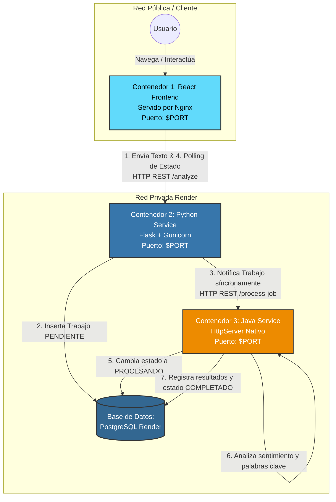
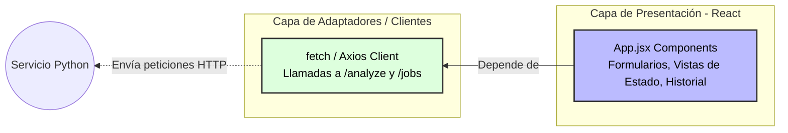
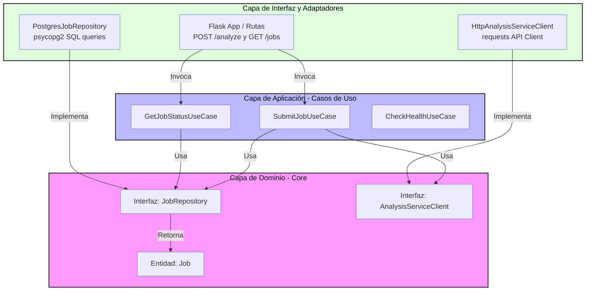
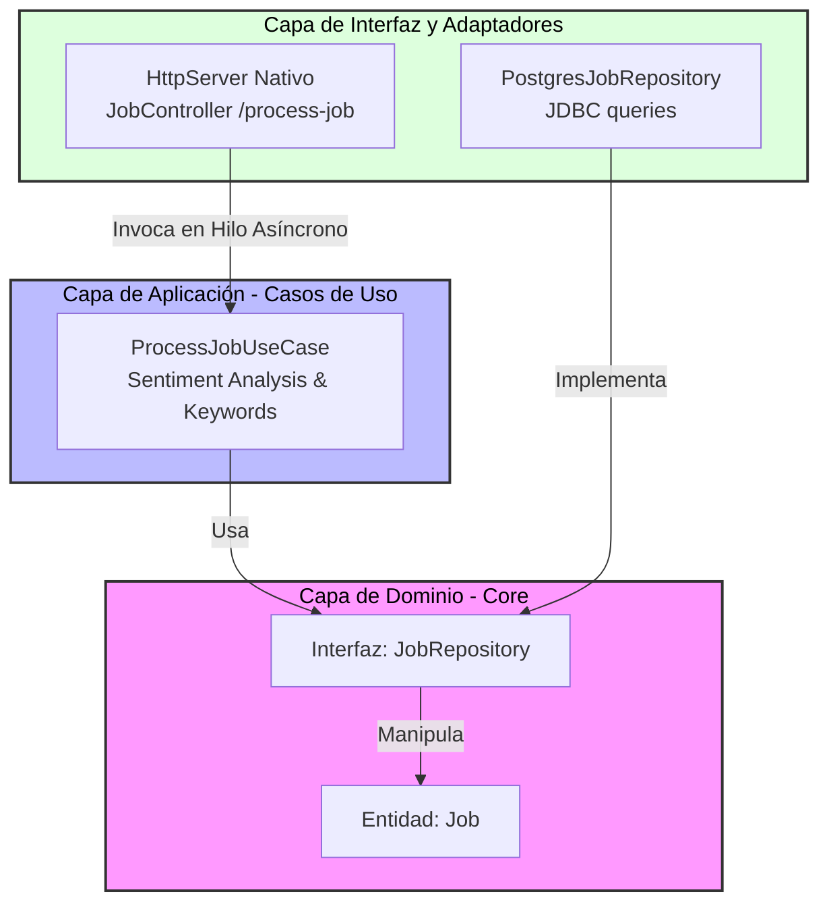

# Diagramas de Arquitectura - AnalytiCore

Este documento contiene el **Diagrama de Componentes** y los **Diagramas de Capas** (Clean Architecture) de cada uno de los microservicios de la plataforma "AnalytiCore".

---

## 1. Diagrama de Componentes (Arquitectura General)

Muestra la interacción a través de la red (APIs REST) de los contenedores Docker desplegados y la base de datos centralizada en Render.

---

## 2. Diagramas de Capas (Arquitectura Limpia Interna)

La regla de dependencia establece que las capas externas solo conocen y dependen de las capas internas.

### A. Componente 1: Frontend (`frontend`)

### B. Componente 2: Python Service (`python-service`)

### C. Componente 3: Java Service (`java-service`)

