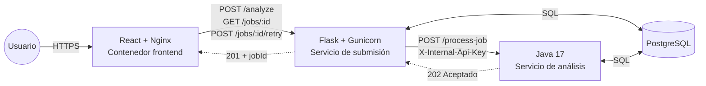
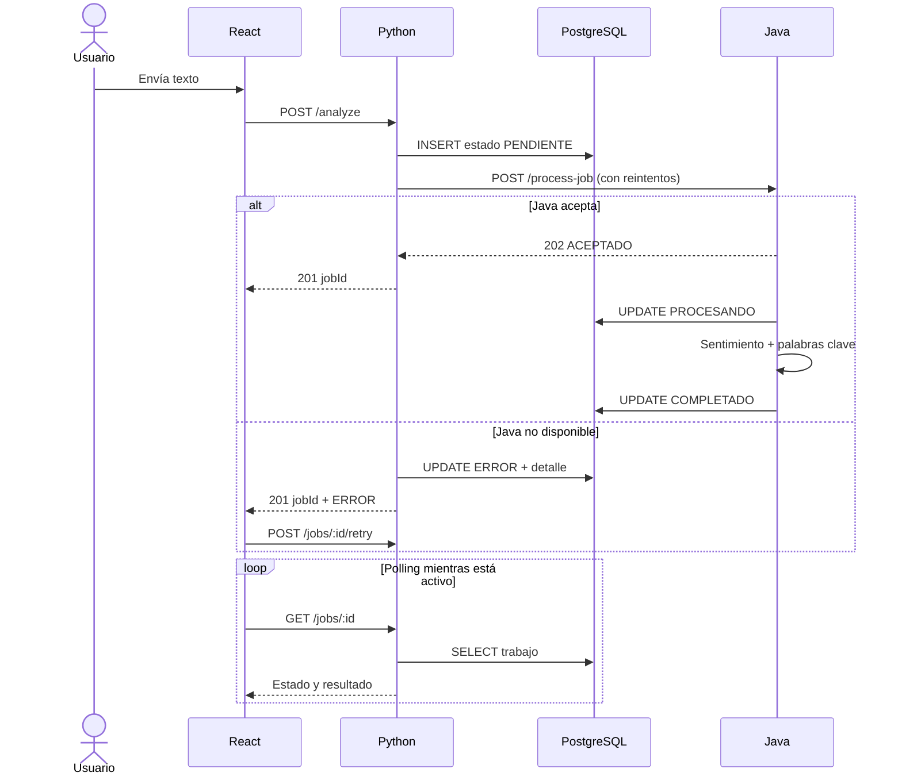
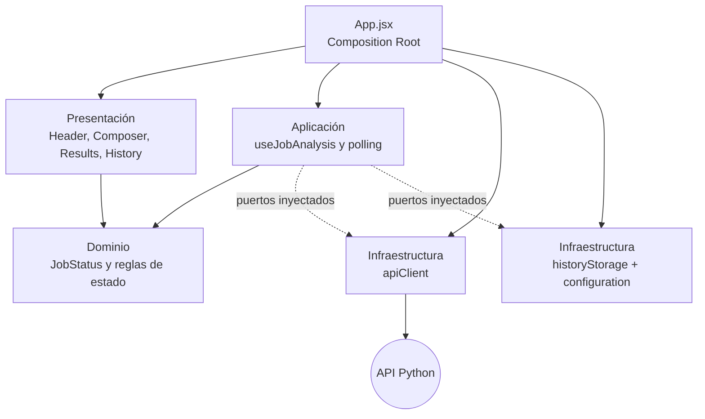
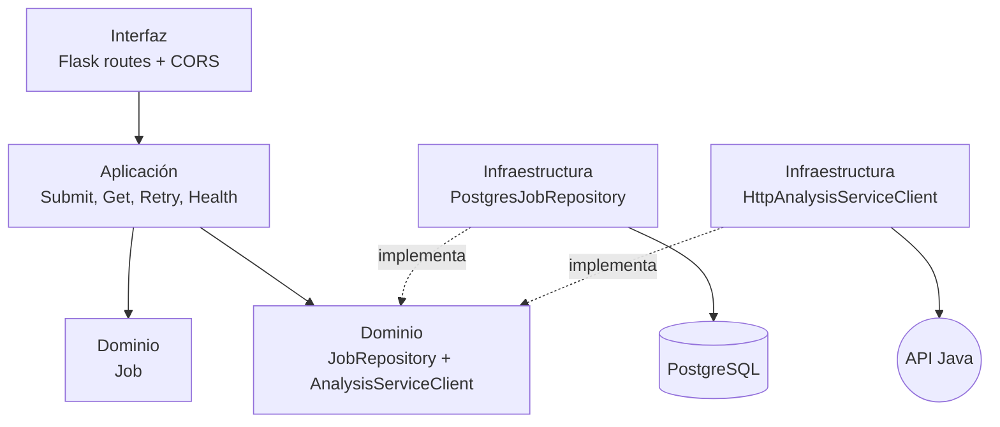
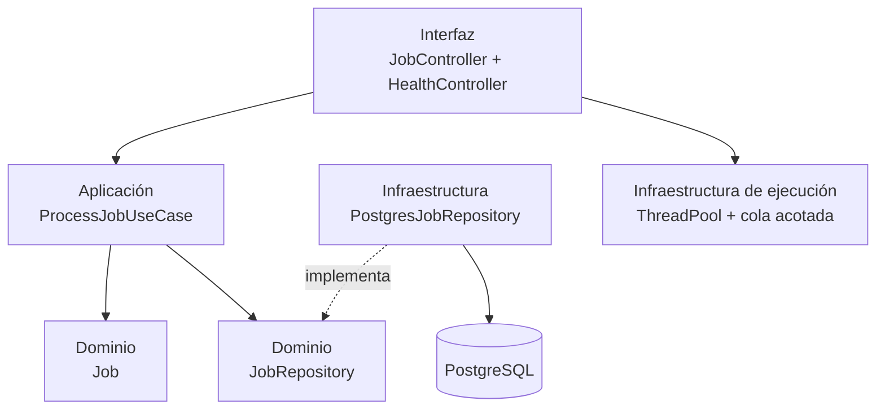

# Diagramas de arquitectura de AnalytiCore

## 1. Diagrama de componentes

En Render gratuito los tres contenedores son Web Services. Java es públicamente direccionable, pero su operación de procesamiento exige una credencial compartida. En un plan pagado Java debe convertirse en Private Service.

## 2. Flujo de un trabajo

## 3. Capas del frontend

`App.jsx` actúa como Composition Root e inyecta los adaptadores externos al caso de uso React. La aplicación no importa directamente infraestructura.

## 4. Capas del servicio Python

## 5. Capas del servicio Java

